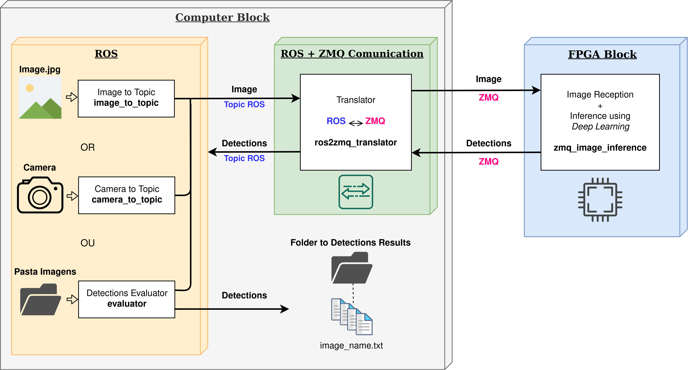
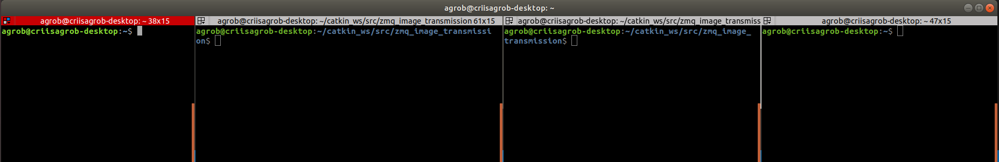
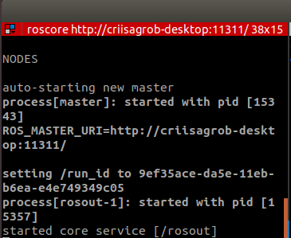
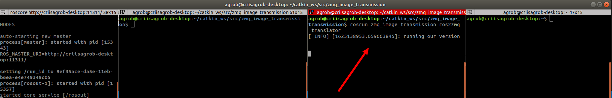
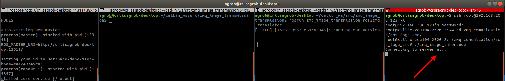
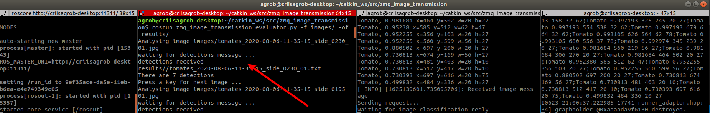

# Distributed Architecture between ROS and an FPGA for Inference, using ZMQ communication protocol.

## This tutorial explains the process of using the architecture, for send images from ROS to FPGA for inference, using ZMQ comunication protocol.

**This repository was tested on ROS Melodic and Noetic, and was used FPGA Xilinx ZYNQ ZCU104 for image inference.**

### In the folders provided in this repository, they contain the files for use, namely:

- Scripts
    - evaluator.py
- Src
    - image_to_topic.cpp
    - ros2zmq_translator.cpp
    - zmq_image_inference.cpp
    - inference_code_images.c (script only to make inference inside FPGA)

The others files was used only for testing and develop the final versions.

**You can see a video of the process of using the architecture, at the following link:** \
https://www.youtube.com/watch?v=mUWGEfI7Gak

## Let's Start, first let's take a look to the Architecture!
 

We have 2 Blocks, the Computer and the FPGA, and we want to send images from ROS to the FPGA, and get a reply with the detections. \
**After start, clone or download to your machine this repository to start using it.**

## Step 1 - Open 4 terminal windows

- The First Terminal we will use to start the ROS system
- The Second Terminal We will use to run the Evaluator script
- The Third Terminal is for the ROS + ZMQ Comunication (Translator)
- The last one and Fourth Terminal is to connect via SSH to the FPGA and Run Inference code

 

**Attention:**\
On the 2 and 3 terminal open your zmq_image_transmission folder!!

## Step 2 - Start ROS System
Now let's start ROS system to initialize the process!
Use the next command in the first window.

### Staring ROS
```bash
    roscore
```
 

## Step 3 - Start Communication between Computer and FPGA
Now we need to start the communication between the translator (ROS + ZMQ Comunication) and the FPGA Block!\

### So let's run the translator first, using the next command:
```bash
	rosrun zmq_image_transmission ros2zmq_translator
```
 

## Step 4 - Run FPGA Inference Code

Let's continue and access via SSH the FPGA and run the inference code!
Use the command **root@ipaddress -X** and navigate into the inference folder. \

### Then use the following command:
```bash
	./zmq_image_inference
```
 

## Step 5 - Start Evaluation Request

Now we are prepared to start making inference using the ROS system, to send images to the FPGA and make inference. \
### Let's begin in the second terminal window, with the following command:
```bash
	-f <folder_images> and -of <results_of_detections>
```

### By replacing the paths, the correct command shold be similar to:

```bash
    rosrun zmq_image_transmission evaluator.py -f images/ -of results/
```
 

\
Let's see what happens !! 


 

On the folder Results are the .txt files with the bounding boxes detections.


### Authors
Miguel Riem Oliveira \
Tiago Cerveira Padilha